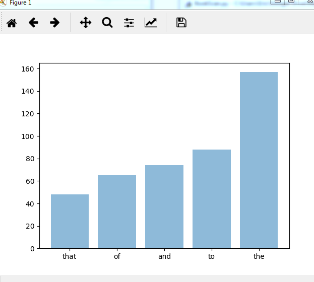
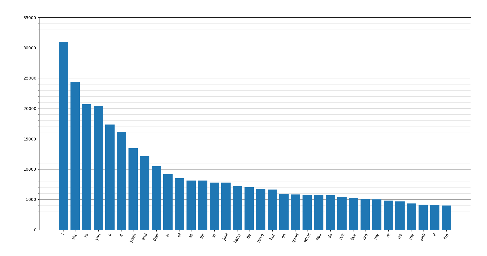
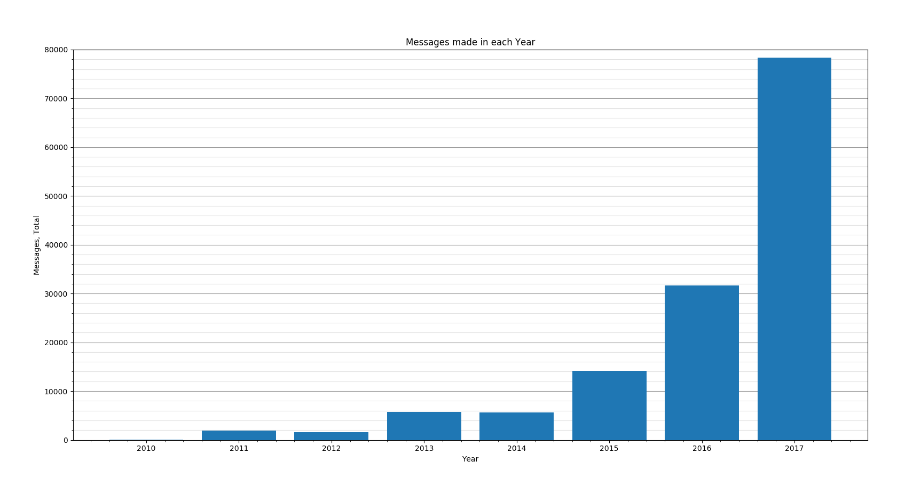
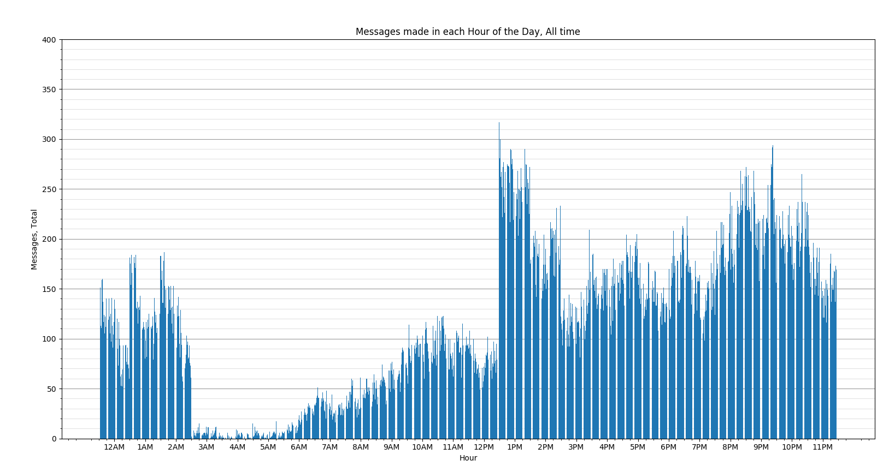

# Messenger Data Analysis

### https://ericezam.github.io/MessengerDataAnalysis/

Application to analyse Facebook Messenger data.

**The below was written in 2018.**

I am not a super experienced developer, especially when it comes to JavaScript, so the code might be a little bit messy.

This project initially started in 2017 as a Python script that used a HTML parser to get information from the Facebook download. At the time, HTML was the only format Facebook offered their data download. The option to download in JSON now makes analysis a lot easier (and much much faster). Ultimately the Python version was left in a place where I was pretty happy with it for person use, but it wasn't something that was ready to be distributed or widely used. It was also slow due to the bulkiness of HTML data.

The project was revisited a couple of times in early 2018, but not a lot of progress was made. I tried writing it in C# but there were too many complications - and the .Net framework was not ideal for cross-platform applications. I also did not want to make a website where the data analysis was done server-side. This would raise privacy issues and bring about the possibility of the data being intercepted somehow by a malicious third party. As a novice developer with no server-side experience, this is not risk I wanted to take on. 

In mid-2018 I started learning some JavaScript, and thought that this language would be well suited to the project. Additionally, it would allow me to develop a browser-based solution, which would be easier to share than one in Python or C#. One downside was the loss of multi-file analysis. JavaScript is limited to analysing 1 conversation at a time, while the other platforms could run through many files at once. This is a small price to pay for all the benefits that come from using JS, though.

At the start of 2019 the site was revamped so it was both faster and looked better.

Some figures from the original python script:

  
  
  
  

